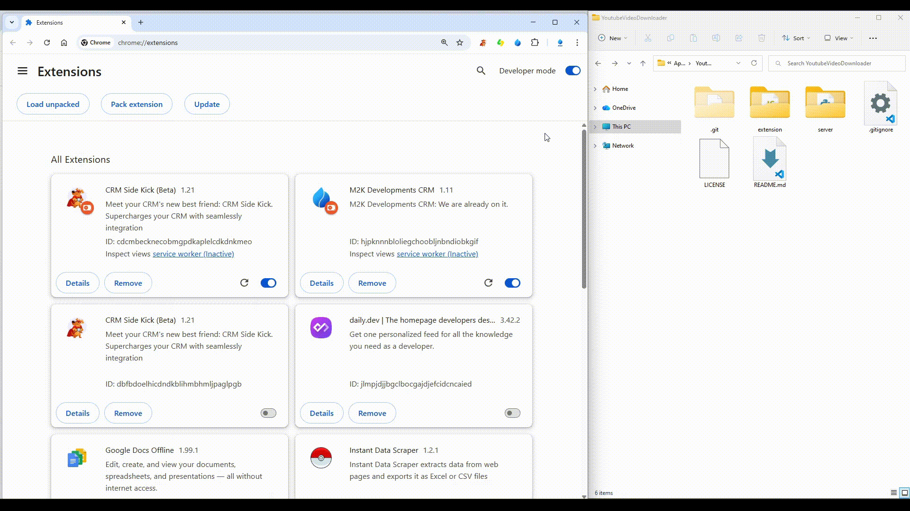
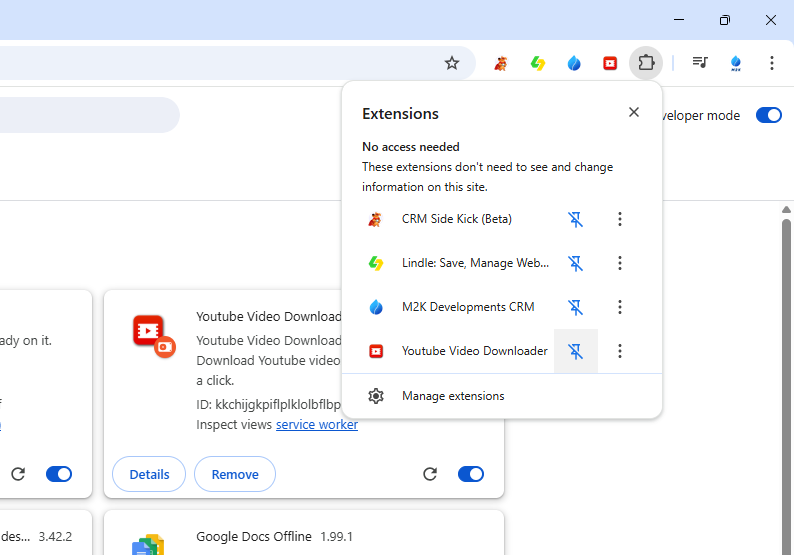

# Youtube Video Downloader


This is a chrome browser extension. It functions as a Youtube Video Downloader. Inserting a download button on the page of a Youtube video so that the user can download the videos locally. No Ads for now.


## Install the chrome extension



## Pin the chrome extension



## Make sure you have python 3 install your computer
```bash
https://www.python.org/downloads/
```

## Install Python Libraries
-- Run any of the following scripts by clicking on <a href="./setup.bat">setup.bat</a> or <a href="./setup.sh">setup.sh</a>


## Run Python Server
-- Run any of the following scripts by clicking on <a href="./runserver.bat">runserver.bat</a> or <a href="./runserver.sh">runserver.sh</a>


## How it works
-- After ther python server is running make sure you. Go on any youtube video then click the extension icon that you pin and just want for it to download.


## Support
-- You can support us with any amount. It's all appreciated.

<a href="https://www.buymeacoffee.com/m2kdevelopments" target="_blank">
    
</a>

<a href="https://paypal.me/m2kdevelopment" target="_blank">
    
</a>

## Support (from Malawi or USA)
<a href="https://give.paychangu.com/dc-RqLWVw" target="_blank">
    <div style="padding:10px 10px; border-radius:30px; color:white;background:cyan; display:flex; gap:2px; width:300px; height:100px;">
        Support via Paychangu
    </div>
</a>